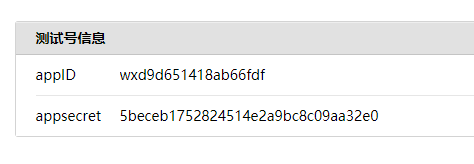
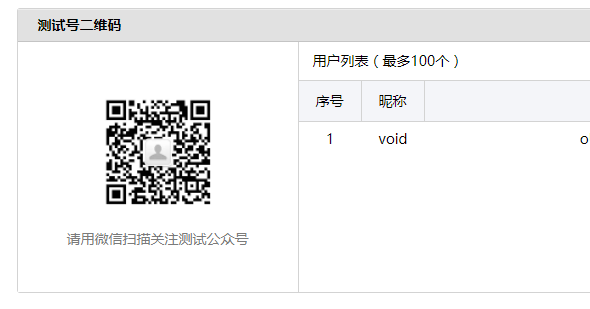
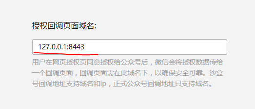

# Sample_OAuth

Similar to [Sample_AuthServer](../Sample_AuthServer), this is a sample of using vIDM as
SP and your web application as IDP. However, your web application can verify the user by
OAuth, that is, send OAuth requests to OAuth Server (such as WeChat), and get the user's
information, then map the uid to vIDM user, to authorize the user.

In our toolkit, we support OAuth of WeChat, Sina Weibo, Google and Facebook. You may support
your own OAuth Server you want by extending
[OAuth2](../SamlToolkit/src/main/java/com/vmware/eucenablement/oauth/OAuth2.java) class.  

In this sample, we only show you how to login with WeChat.

## How to use this sample

### Prerequisites

* A valid vIDM administrator account.
* Java 1.6+, Maven.
* A WeChat account.
* Be sure your mobile can access the server your web application run on.

### Configuration

There are some configurations to run your web application.

1. Check your host or IP address your web application will run on. Be sure your mobile can
access it. Let's call it `${host}`.

2. Go to [idp.xml](webapp/idp.xml#L66), and change the location url to your own `${host}`.

3. Go to [WeChat sandbox](https://mp.weixin.qq.com/debug/cgi-bin/sandbox?t=sandbox/login) to request a test public account.


4. Remember the APPId and APPSecret, and configure them to 
[WeChatServlet](src/main/java/com/vmware/eucenablement/sample/servlet/WeChatServlet.java#34).


4. Scan the QRCode to follow the test public account.


5. Config the redirect URL to `${host}:8443`.



6. Follow the instructions in [Sample_AuthServer](../Sample_AuthServer/#prerequisites) to
config your vIDM.

### Build & Run

Be sure you have installed the SamlToolkit by `mvn clean install` on the project base directory.  
Run the following command to start your web application.
```
mvn compile exec:java
```
Then, open [https://${host}:8443/MyAuthServer](https://${host}:8443/MyAuthServer), and just
follow the instructions displayed.  
You MUST use `${host}` on your browser instead of `127.0.0.1` or `localhost`, because your
mobile will use the SAME URL to verify the user.

## What you need to do

Just refer [wxLogin.jsp](webapp/wxLogin.jsp) and [WeChatServlet](src/main/java/com/vmware/eucenablement/sample/servlet/WeChatServlet.java)
to see how it works.

We generate QRCode by myself, however if you have a valid public account, you can generate
QRCode by WeChat. Refer [here](https://open.weixin.qq.com/cgi-bin/showdocument?action=dir_list&t=resource/res_list&id=open1419316505)
for more details.

We only provided the WeChat OAuth sample because other OAuth Server don't offer a test 
public account. But if you have the APPId and APPSecret of other OAuth Server, including
[Weibo](http://open.weibo.com/authentication/), [Google](https://developers.google.com/identity/protocols/OAuth2WebServer)
or [Facebook](https://developers.facebook.com/docs/facebook-login/manually-build-a-login-flow),
you can use your own.  

You can also support your own OAuth Server you want by extending
[OAuth2](../SamlToolkit/src/main/java/com/vmware/eucenablement/oauth/OAuth2.java) class. 

## Documentation

If you want to login with WeChat, just do the following:

Step 1. Same as Step 1 in [Sample_AuthServer](../Sample_AuthServer/#Documentation).

Step 2. Create a WeChatOAuthImpl by your appid and appsecret. Save it to HttpSession.
```
HttpSession session = req.getSession();
WeChatOAuth2Impl weChatOAuth2 = (WeChatOAuth2Impl)session.getAttribute("oauth");
if (weChatOAuth2 == null) {
    // Use your own APP_ID, APP_SECRET and REDIRECT_URI here.
    weChatOAuth2 = new WeChatOAuth2Impl(new OAuth2Config(APP_ID, APP_SECRET, REDIRECT_URI);
    session.setAttribute("oauth", weChatOAuth2);
}
return weChatOAuth2;
```

Step 3. Same as Step 2 in [Sample_AuthServer](../Sample_AuthServer/#Documentation).

Step 4. When you need to authorize the user, just display the QRCode, and use your WeChat to scan it.
* Generate QRCode by myself, and redirect the WeChat Browser to Authorization URL.
    ```
    // For browser, generate the qrcode
    " />
    
    
    // The mobile will be redirected to the Authorization URL.
    response.sendRedirect(WeChatServlet.getWeChatOAuth(request).getAuthorizationUrl(state));
    ```
* If you have your own public account, you can also use the QRCode generated by WeChat.
    ```
    response.sendRedirect(WeChatServlet.getWeChatOAuth(request).getAuthorizationQrcodeUrl(
                OAuthUtil.encode(request.getRequestedSessionId())));
    ```

Step 5. After WeChat authorize your user, it will redirect to REDIRECT_URI with parameters `state` and `code`.
Just get `access_token` and `openid` using `code`.
```
weChatOAuth2.getAccessTokenFromOAuthServer(code);
String openid = weChatOAuth2.getOpenId();
String access_token = weChatOAuth2.getCurrentAccessToken().getAccessToken();
```

Step 6. Map the openid to valid vIDM user, and do same as Step 4 in [Sample_AuthServer](../Sample_AuthServer/#Documentation).

=======================================================

If you want to use other OAuth Server, just redirect the browser to the authorization URL in Step 3.
```
response.sendRedirect(getOAuth2().getAuthorizationUrl(state));
```

Then, get the `access_token` and `uid` by `code` similar to above.
```
OAuth2 oAuth2 = getOAuth2();

// Get access coken
oAuth2.getAccessTokenFromOAuthServer(code);
String access_token = oAuth2.getCurrentAccessToken().getAccessToken();

// Refresh access token if needed
oAuth2.refreshAccessToken();

// Get user info from OAuth Server
oAuth2.getUserInfo();
// Decode information you need based on the return message.
String uid = oAuth2.getCurrentAccessToken().getValue("uid");
```


